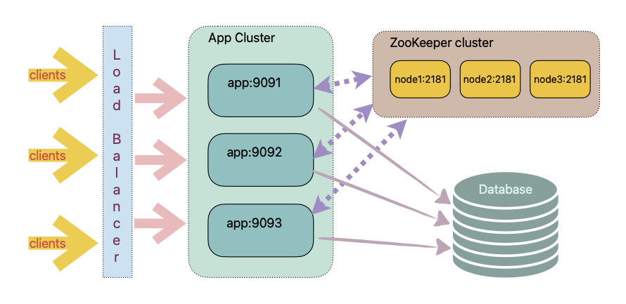
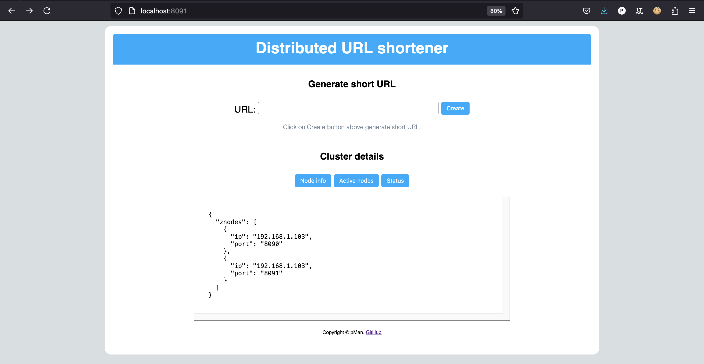

# distributed-url-shortener
A distributed URL shortener in Java using ZooKeeper for resource management.

## Architecture

</img>

## Design
- Each node works independantly and is accessible thorugh HTTP.
- Each node exposes a few endpoints that clients can invoke.
- Each node has a GUI which displays node status, IP & port it is running on, and other active nodes in the cluster.
- Each node registers itself as an Ephemeral ZNode on the ZooKeeper cluster upon start up.
- The leader Node also registers a Global State ZNode to keep track of the URL hashes used so far and next available value.
- Each Node can synchronously set the next available hash, and exclusively subscribe a range of hash values from the Global State ZNode.
- URLs and corresponding hashes will be persisted in an RDBMS table with two columns (hash, url).

## How to run

#### Clone and build kochudb
```
> git clone https://github.com/pMan/distributed-url-shortener.git
> cd distributed-url-shortener
> mvn clean package -DskipTests
```

#### Run in stand alone mode
```
> java -jar target/distributed-url-shortener-1.0-SNAPSHOT-jar-with-dependencies.jar
```

#### Run overriding default properties
```
> java -jar target/distributed-url-shortener-1.0-SNAPSHOT-jar-with-dependencies.jar res/app1.properties
```

## Web interface of individual application

#### Application running on port http://localhost:8091
* active nodes are listed in the home page

</img>
