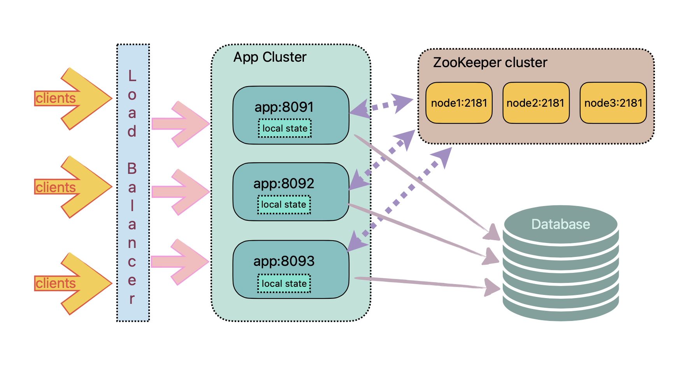

# distributed-url-shortener
A distributed URL shortener in Java using ZooKeeper for resource management.

## Architecture

</img>

## Design
- Each node works independantly and is accessible thorugh HTTP.
- Each node exposes a few endpoints that clients can invoke.
- Each node has a GUI which displays node status, IP & port it is running on, and other active nodes in the cluster.
- Each node registers itself as an Ephemeral ZNode on the ZooKeeper cluster upon start up.
- The leader Node also registers a Global State ZNode to keep track of the URL hashes used so far and next available value.
- Each Node can synchronously set the next available hash, and exclusively subscribe a range of hash values from the Global State ZNode.
- URLs and corresponding hashes will be persisted in an RDBMS table with two columns (hash, url).

## How to run
Clone the repository
```
> git clone https://github.com/pMan/distributed-url-shortener.git
> cd distributed-url-shortener
```
There are few ways to launch the app.

### 1. Run with Docker
#### Use `docker compose`
```
> docker compose up
```
The above command will use `docker-compose.yml` file present in the root directory of this repo. Note that the `docker compose` will download and run below components. 
* postgres database server
* zookeeper server
* this application image

All images are downloaded from Docker hub and run locally. They don't save state on exit.

Run `docker compose stop` to stop all services.

### 2. Run manually
In this case, you need to have a zookeeper cluster and postgres database up and running.
Edit the `src/main/resources/application.properties` file, update zookeeper and datasource configuration properties. Then run below command.
Run the postgres script to set up user, database, schema and table.
```
> psql -h <host> -d <database> -U <user> -p 5432 -a -q -f src/main/resources/postgres_local_setup.sql
```
And then run below commands.
```
> mvn clean package -DskipTests
> java -jar target/distributed-url-shortener-1.0-SNAPSHOT-jar-with-dependencies.jar
```
Alternatively, default properties can be overriden by providing a command line argument.

Multiple instances of the app can be run by providing each instance with a unique properties file, as given below, so that they can form a cluster.

They may share the zookeeper cluster and postgres database, but each instance must have a unique port to listen to.
```
> java -jar target/distributed-url-shortener-1.0-SNAPSHOT-jar-with-dependencies.jar res/app1.properties
> java -jar target/distributed-url-shortener-1.0-SNAPSHOT-jar-with-dependencies.jar res/app2.properties
```

## Web interface of individual application

#### Application running on port http://localhost:8091
* active nodes are listed in the home page

</img>

## JMH stats for hash generator
Below table shows the result of throughput and average time tests of the hash function.

```
Benchmark                                   Mode  Cnt   Score   Error   Units
CustomBase64EncoderBenchmark.longToBase64  thrpt    5   0.033 ± 0.003  ops/ms
CustomBase64EncoderBenchmark.longToBase64   avgt    5  30.058 ± 2.165   ms/op
```
